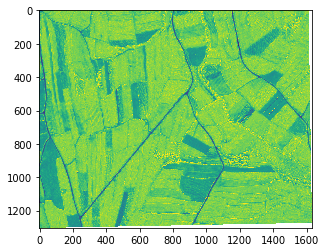
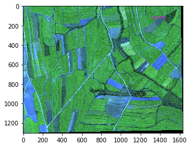
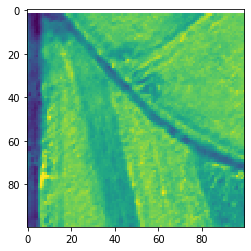
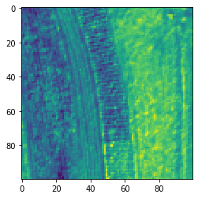

# Temdet
Project use thg NMS　＆ Template that choosen by manual work algorithm to detect object with minimum interclass variance.

<!--
 Copyright 2020 winshare
 
 Licensed under the Apache License, Version 2.0 (the "License");
 you may not use this file except in compliance with the License.
 You may obtain a copy of the License at
 
     http://www.apache.org/licenses/LICENSE-2.0
 
 Unless required by applicable law or agreed to in writing, software
 distributed under the License is distributed on an "AS IS" BASIS,
 WITHOUT WARRANTIES OR CONDITIONS OF ANY KIND, either express or implied.
 See the License for the specific language governing permissions and
 limitations under the License.
-->


## Algorithm Guide


```python
import matplotlib.pyplot as plt
from temdet import nmsdet
detector=nmsdet("/workspace/data/clip/clip1.tif",CHANNEL_INDEX=[0,1,2,3])#For NDVI
#detector=nmsdet("/workspace/data/clip/clip1.tif",CHANNEL_INDEX=[0,1,2])#For RGB

```

    # ---------------------------------------------------------------------------- #
    #                    NMS&Template MApping Toolkit                              #
    # ---------------------------------------------------------------------------- #
    -----Template NMS detect in : 
     /workspace/data/clip/clip1.tif 
     Mon Apr 27 16:21:57 2020
    # ---------------------------------------------------------------------------- #
    #                            TIFF process Toolkit                              #
    # ---------------------------------------------------------------------------- #
    -----TIFF Class Init with : /workspace/data/clip/clip1.tif
    -----Original Data Shape :  (4, 1303, 1631)
    image type : int16
    image shape (1303, 1631, 4)


```python
ndvi=detector.buildndvi()
plt.imshow(ndvi),plt.show()
```





    (<matplotlib.image.AxesImage at 0x7f0bfebe0908>, None)


```python
detector.addbox(0,0,100,100)
detector.detect(drawbox=True)
print("boxes",detector.boxes,"conf",detector.conf)
```

      0%|          | 0/2 [00:00<?, ?it/s]


     50%|█████     | 1/2 [00:00<00:00,  4.36it/s]

    feature  0  mapping : 2


    100%|██████████| 2/2 [00:00<00:00,  4.99it/s]
    1it [00:00, 5275.85it/s]

    feature  0  mapping : 1


    
    Clipping input data to the valid range for imshow with RGB data ([0..1] for floats or [0..255] for integers).





    boxes [(0, 0, 100, 100)] conf [0.7265027]


```python
detector.addbox(100,100,200,200)
detector.detect(drawbox=True)
print("boxes",detector.boxes,"conf",detector.conf)
```

      0%|          | 0/3 [00:00<?, ?it/s]





     33%|███▎      | 1/3 [00:00<00:00,  4.13it/s]

    feature  0  mapping : 2


     67%|██████▋   | 2/3 [00:00<00:00,  4.47it/s]

    feature  0  mapping : 2





    100%|██████████| 3/3 [00:00<00:00,  5.17it/s]
    2it [00:00, 3833.92it/s]

    feature  0  mapping : 2


    
    Clipping input data to the valid range for imshow with RGB data ([0..1] for floats or [0..255] for integers).


    boxes [(0, 0, 100, 100), (100, 100, 200, 200)] conf [0.78325445 0.79081626]


```python

```


## AI Label Toolkit for GIS

This part work for data format transform on GIS imagery to generate dataset for AI training work. 


## Install

## Guide to start


## Document

- [Temdet](#temdet)
  - [Algorithm Guide](#algorithm-guide)
  - [AI Label Toolkit for GIS](#ai-label-toolkit-for-gis)
  - [Install](#install)
  - [Guide to start](#guide-to-start)
  - [Document](#document)
    - [TIF file IO](#tif-file-io)
      - [Read](#read)
        - [getfiles_from_dir](#getfilesfromdir)
      - [Set](#set)
      - [Write](#write)
        - [writeimagery](#writeimagery)
        - [writetif](#writetif)
        - [writethreshold2shp](#writethreshold2shp)
      - [Process](#process)
        - [fast_percentager_strentching](#fastpercentagerstrentching)
        - [resize_raster](#resizeraster)
      - [Cord Transform](#cord-transform)
        - [geo2lonlat](#geo2lonlat)
        - [lonlat2geo](#lonlat2geo)
        - [imagexy2geo](#imagexy2geo)
        - [geo2imagexy](#geo2imagexy)
        - [imagexy2lonlat](#imagexy2lonlat)
    - [Shapefile IO](#shapefile-io)
      - [readshp](#readshp)
      - [feature_field_Defn](#featurefielddefn)
      - [statsic](#statsic)
      - [format transform](#format-transform)
        - [shp2LabelmeJson](#shp2labelmejson)
        - [json2Voclike](#json2voclike)


### TIF file IO

#### Read
##### getfiles_from_dir
#### Set

#### Write

##### writeimagery
##### writetif
##### writethreshold2shp

#### Process
##### fast_percentager_strentching
##### resize_raster

#### Cord Transform
##### geo2lonlat
##### lonlat2geo
##### imagexy2geo
##### geo2imagexy
#####　lonlat2imagexy
##### imagexy2lonlat


### Shapefile IO
#### readshp
#### feature_field_Defn
#### statsic
#### format transform 
##### shp2LabelmeJson
##### json2Voclike


        Init shapes contents
        Use like : initlabeljson()['shapes'].append(initcordarrary(Type,Cordlist))
        :param Type: Type in Shapefile with (['Storge yard', 'Container', 'Oil Tank', 'Berth'])
        :param line_color: init by null
        :param fill_color: init by null
        :param Cordlist: like [ [ [ 114.062252545881549, 33.884823424589996 ], [ 114.063734485974663, 33.885029393359083 ],..........
        :return:


Shpfile

        invert the Shapefile to labelme_Json
        Flow I  : Read Tif & Shapefile -> Dataset & DataSource
        Flow II : Init Null labelme_json dict
        Flow III: Get Cords(x,y) & Feature and invert longtitude,latitude to image cols,rows
        Flow IV : Append image Cords list to dict
        Flow V  : Output Labelme Json
        Flow VI : Use System Command labelme_json_to_dataset / labelme2voc.py
                # It generates:
                #   - data_dataset_voc/JPEGImages
                #   - data_dataset_voc/SegmentationClass
                #   - data_dataset_voc/SegmentationClassVisualization
        :param shp_path:
        :param tif_path:
        :param Labelme_Json_path: Output Json&jpg path
        :param invert2Dataset: invert labelme json to Dataset
        :param  TYPE like (['Storge yard', 'Container', 'Oil Tank', 'Berth'])
        :return: