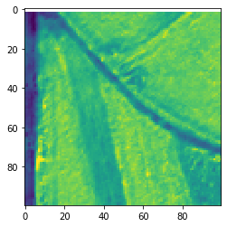
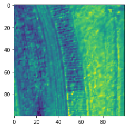
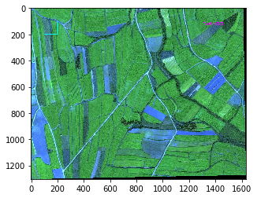

```python
import matplotlib.pyplot as plt
from temdet import nmsdet
detector=nmsdet("/workspace/data/clip/clip1.tif",CHANNEL_INDEX=[0,1,2,3])#For NDVI
#detector=nmsdet("/workspace/data/clip/clip1.tif",CHANNEL_INDEX=[0,1,2])#For RGB

```

    # ---------------------------------------------------------------------------- #
    #                    NMS&Template MApping Toolkit                              #
    # ---------------------------------------------------------------------------- #
    -----Template NMS detect in : 
     /workspace/data/clip/clip1.tif 
     Mon Apr 27 16:21:57 2020
    # ---------------------------------------------------------------------------- #
    #                            TIFF process Toolkit                              #
    # ---------------------------------------------------------------------------- #
    -----TIFF Class Init with : /workspace/data/clip/clip1.tif
    -----Original Data Shape :  (4, 1303, 1631)
    image type : int16
    image shape (1303, 1631, 4)


```python
ndvi=detector.buildndvi()
plt.imshow(ndvi),plt.show()
```


    (<matplotlib.image.AxesImage at 0x7f0bfebe0908>, None)


```python
detector.addbox(0,0,100,100)
detector.detect(drawbox=True)
print("boxes",detector.boxes,"conf",detector.conf)
```

      0%|          | 0/2 [00:00<?, ?it/s]


     50%|█████     | 1/2 [00:00<00:00,  4.36it/s]

    feature  0  mapping : 2





    100%|██████████| 2/2 [00:00<00:00,  4.99it/s]
    1it [00:00, 5275.85it/s]

    feature  0  mapping : 1


    
    Clipping input data to the valid range for imshow with RGB data ([0..1] for floats or [0..255] for integers).


    boxes [(0, 0, 100, 100)] conf [0.7265027]


```python
detector.addbox(100,100,200,200)
detector.detect(drawbox=True)
print("boxes",detector.boxes,"conf",detector.conf)
```

      0%|          | 0/3 [00:00<?, ?it/s]


     33%|███▎      | 1/3 [00:00<00:00,  4.13it/s]

    feature  0  mapping : 2


     67%|██████▋   | 2/3 [00:00<00:00,  4.47it/s]

    feature  0  mapping : 2





    100%|██████████| 3/3 [00:00<00:00,  5.17it/s]
    2it [00:00, 3833.92it/s]

    feature  0  mapping : 2


    
    Clipping input data to the valid range for imshow with RGB data ([0..1] for floats or [0..255] for integers).





    boxes [(0, 0, 100, 100), (100, 100, 200, 200)] conf [0.78325445 0.79081626]


```python

```
